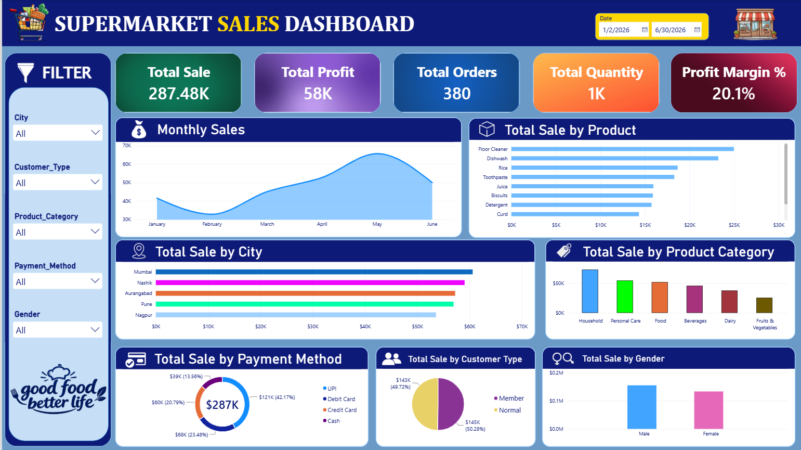

# 🛒 Supermarket Sales Dashboard | Power BI

> 📊 **An interactive Power BI dashboard to analyze supermarket sales, profit, products, customers, cities, and payment trends.**

---

## 📌 Project Overview

The **Supermarket Sales Dashboard** is an interactive data visualization project developed using **Microsoft Power BI**.

The dashboard transforms raw supermarket sales data into meaningful business insights through interactive charts, KPIs, filters, and analytical visuals.

It provides a comprehensive view of:

* 💰 Sales & Profit Performance
* 📦 Orders & Quantity Sold
* 🛍️ Product Performance
* 🏙️ City-wise Sales
* 🗂️ Product Categories
* 💳 Payment Methods
* 👥 Customer Types
* 🚻 Gender-wise Sales
* 📅 Monthly Sales Trends

---

## 🛠️ Tools & Technologies

| 🧰 Tool                   | 🎯 Purpose                     |
| ------------------------- | ------------------------------ |
| 📊 **Microsoft Power BI** | Dashboard & Data Visualization |
| 🔄 **Power Query**        | Data Cleaning & Transformation |
| 📐 **DAX**                | Measures & Calculations        |
| 📈 **Data Visualization** | Business Insights & Reporting  |

---

## 📊 Key Performance Indicators (KPIs)

| 📌 KPI                |    📈 Value |
| --------------------- | ----------: |
| 💰 **Total Sales**    | **287.48K** |
| 💵 **Total Profit**   |     **58K** |
| 🧾 **Total Orders**   |     **380** |
| 📦 **Total Quantity** |      **1K** |
| 📊 **Profit Margin**  |   **20.1%** |

---

## 📈 Dashboard Features

### 📅 Monthly Sales Analysis

Track sales performance across different months and identify the months with the highest revenue.

### 🛍️ Sales by Product

Compare individual products and identify the best-performing products.

### 🏙️ Sales by City

Analyze geographical sales performance and discover the highest-performing cities.

### 🗂️ Sales by Product Category

Understand which product categories contribute the most to overall sales.

### 💳 Sales by Payment Method

Analyze customer payment preferences such as UPI and other payment methods.

### 👥 Customer Type Analysis

Compare sales generated by different customer types.

### 🚻 Gender-wise Sales Analysis

Understand purchasing patterns based on customer gender.

### 🎛️ Interactive Filters

Use Power BI slicers and filters to dynamically explore different segments of the dataset.

---

## 🔍 Key Business Insights

> 💡 The dashboard highlights several important business insights:

* 🥇 **May** recorded the **highest monthly sales**.
* 🧹 **Floor Cleaner** was the **top-selling product**.
* 🏙️ **Mumbai** generated the **highest city-wise sales**.
* 🏠 **Household** was the **highest-performing product category**.
* 💳 **UPI** was the **most-used payment method by sales value**.
* 📈 The overall **profit margin was 20.1%**, indicating healthy profitability.

---

## 🖼️ Dashboard Preview



---

## 📂 Project Structure

```text
📁 Supermarket-Sales-Dashboard
│
├── 📊 sales dashboard.pbix
│
├── 📁 screenshots
│   └── 🖼️ supermarket-sales-dashboard.png
│
└── 📄 README.md
```

---

## 🚀 How to Use

1. 📥 Download or clone this repository.
2. 🖥️ Open **`sales dashboard.pbix`** using Microsoft Power BI Desktop.
3. 🔄 Refresh the dataset if required.
4. 🎛️ Use the interactive filters and slicers.
5. 📊 Explore sales, profit, products, cities, customers, and payment insights.

---

## 🎯 Project Objectives

The main objectives of this project are to:

* 📊 Build an interactive business dashboard.
* 🧹 Transform and clean raw sales data using Power Query.
* 🧮 Create meaningful KPIs and calculations using DAX.
* 🔎 Identify sales and profit trends.
* 💡 Generate actionable business insights.
* 📈 Present complex sales data in a simple and understandable format.

---

## 💼 Skills Demonstrated

Through this project, the following skills were demonstrated:

* ✅ Power BI Dashboard Development
* ✅ Data Cleaning & Transformation
* ✅ Power Query
* ✅ DAX & KPI Creation
* ✅ Data Modeling
* ✅ Data Visualization
* ✅ Business Intelligence
* ✅ Analytical Thinking
* ✅ Interactive Report Design

---

## 🌟 Project Highlights

**Clean Data → Smart Analysis → Interactive Dashboard → Business Insights**

This project demonstrates how **Power BI can convert supermarket sales data into an interactive business intelligence solution** that helps stakeholders understand performance and make data-driven decisions.

---

## 👨‍💻 Author

**Sahil Meshram**

⭐ If you find this project useful, consider giving the repository a **star**!

---

### 📌 Tags

`Power BI` `DAX` `Power Query` `Data Analytics` `Business Intelligence` `Data Visualization` `Dashboard` `Sales Analysis` `Supermarket Sales` `Data Analysis`
